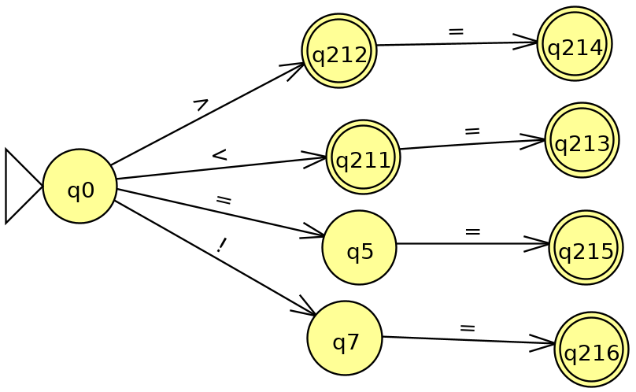
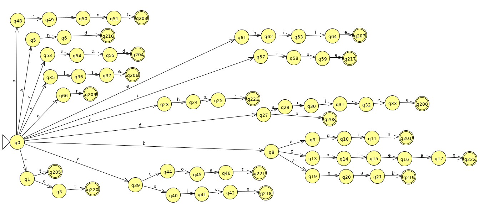
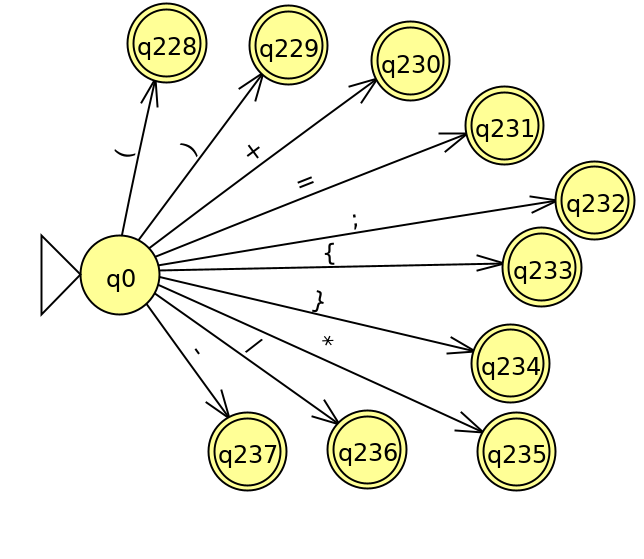
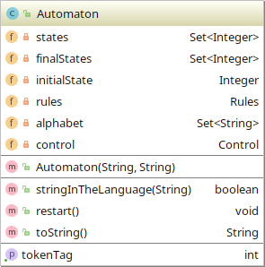
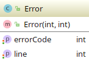
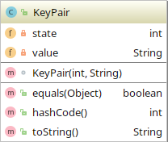
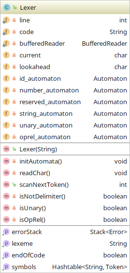
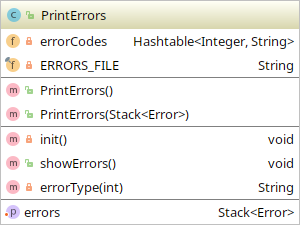

# Fase de análisis de un compilador

## Análisis léxico

### Autómatas

Para la implementación del analizador léxico, se hizo uso de autómatas, 6 en total, estos identifican:

1. **ID**

2. **Números (enteros y flotantes)**

3. **Operadores relacionales (<, >, ==, !=, <=, >=)**

4. **Palabras reservadas**

5. **Cadenas**

6. **Símbolos de un carácter**

### Diagramas de clases

#### Clase Automaton 

#### Clase Control 

#### Clase Error 

#### Clase FileReader 

#### Clase KeyPair 

#### Clase Lexer 

#### Clase PrintErrors 

#### Clase Rules 

#### Clase Tag 

#### Clase Token 

## Análisis sintáctico

## Análisis semántico
