# Fase de análisis de un compilador

1. [Gramática en formato BNF](#gramática-en-formato-bnf)
1. [Análisis léxico](#análisis-léxico)
    1. [Resultado](#resultado)
    1. [Autómatas](#autómatas)
        1. [ID](#id)
        1. [Números](#números)
        1. [Operadores relacionales](#operadores-relacionales)
        1. [Palabras reservadas](#palabras-reservadas)
        1. [Cadenas](#cadenas)
        1. [Símbolos de un carácter](#símbolos-de-un-carácter)
    1. [Diagramas de clases](#diagramas-de-clases)
        1. [Clase Automaton](#clase-automaton)
        1. [Clase Control](#clase-control)
        1. [Clase Error](#clase-error)
        1. [Clase FileReader](#clase-filereader)
        1. [Clase KeyPair](#clase-keypair)
        1. [Clase Lexer](#clase-lexer)
        1. [Clase PrintErrors](#clase-printerrors)
        1. [Clase Rules](#clase-rules)
        1. [Clase Tag](#clase-tag)
        1. [Clase Token](#clase-token)
1. [Análisis sintáctico](#análisis-sintáctico)
1. [Análisis semántico](#análisis-semántico)

## Gramática en formato BNF

```
<programa> ::= { declare <decls> begin <instrs> }
<decls>    ::= <decl> <decls> 
             | ε
<decl>     ::= <tipo> <id>;
<tipo>     ::= int
             | float
             | boolean
             | char
<insts>    ::= <inst> <insts>
<inst>     ::= print(<id>);
             | read(<id>);
             | if (<bool>) { <insts> }
             | if (<bool>) { <insts> } else { <insts> }
             | while (<bool>) { <insts> }
             | do { <insts> } while (<bool>);
             | break;
             | <asig>
<asig>     ::= <id> = <expr>;
<bool>     ::= <bool> or <comb>
             | <comb>
<comb>     ::= <comb> and <comp>
             | <comp>
<comp>     ::= <expr> <oprel> <expr>
             | <expr>
<oprel>    ::= <
             | >
             | <=
             | >=
             | !=
             | ==
<expr>     ::= <expr> + <term>
             | <expr> - <term>
             | <term>
<term>     ::= <term> * <val>
             | <term> / <val>
             | <val>
<val>      ::= <num>
             | <real>
             | true
             | false
             | <cadena>
<num>      ::= [0-9]+
<real>     ::= [0-9]+.[0-9]+
<cadena>   ::= "[a-zA-Z0-9.,-_]*"
<id>       ::= [a-z]([a-zA-Z0-9])*
```

## Análisis léxico

### Casos de uso

#### Uso de cualquier simbolo que no se encuentre dentro del alfabeto

```
{
    declare
        int país;  // Error el caracter 'í' no se encuentra dentro del alfabeto
    begin
        país = 10; // Error el caracter 'í' no se encuentra dentro del alfabeto
}
```

#### Uso de cualquier simbolo que no cumpla con la siguiente expresión regular dentro de una cadena [a-zA-Z0-9.,-_]*

En teoría, una cadena debería de permitir cualquier símbolo, sin embargo, al estar haciendo uso de autómatas 
finitos deterministas, es inviable crear 1,112,064 de reglas para cumplir con toda la tabla de 
[UTF-8](https://en.wikipedia.org/wiki/UTF-8)

```c
{
    declare
        char raro;
    begin
        raro = "El item vale $10.00"; // Error el caracter '$' no se puede colocar dentro de una cadena
}
```


### Autómatas

Para la implementación del analizador léxico, se hizo uso de autómatas, 6 en total, estos identifican:

#### ID

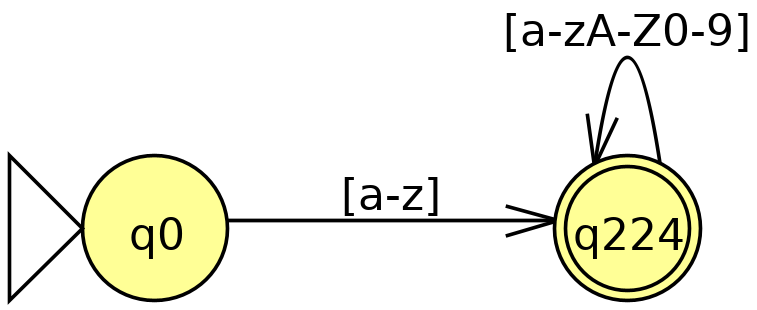

#### Números

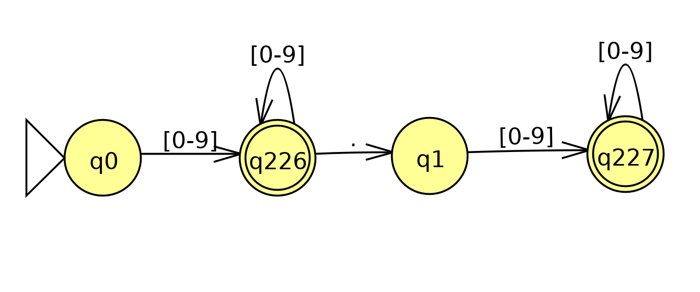

#### Operadores relacionales


#### Palabras reservadas

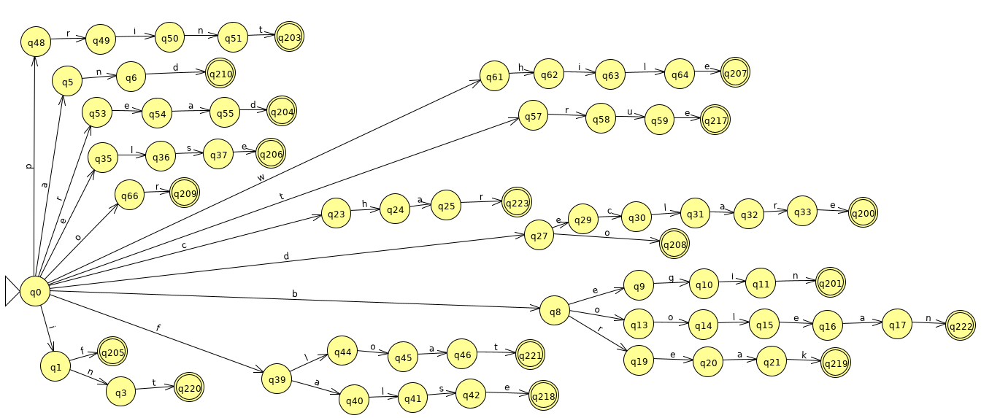

#### Cadenas

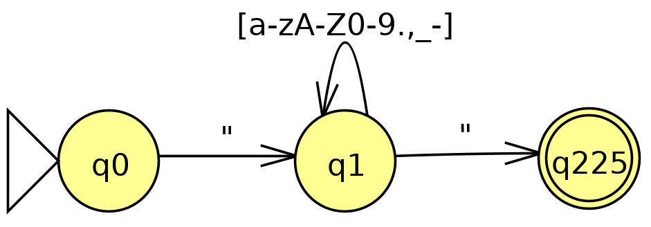

#### Símbolos de un carácter

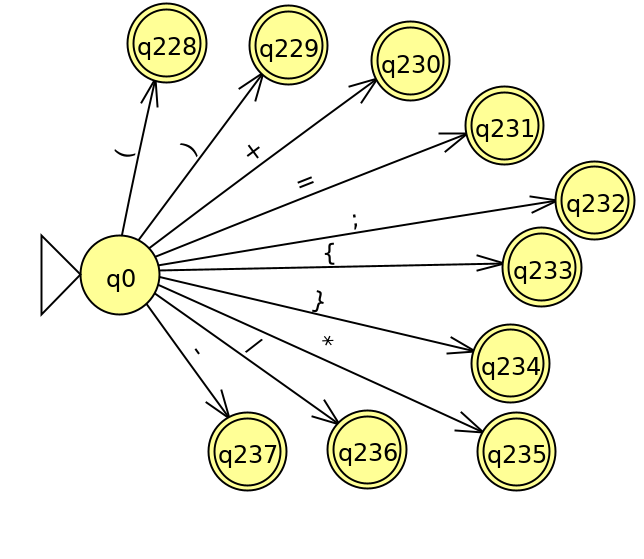

### Diagramas de clases

#### Clase Automaton 

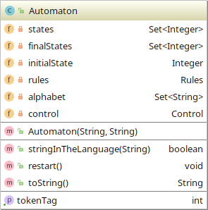


#### Clase Control 

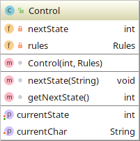


#### Clase Error 

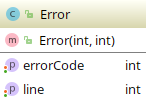


#### Clase FileReader 

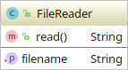


#### Clase KeyPair 


#### Clase Lexer 


#### Clase PrintErrors 

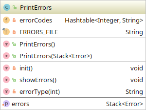


#### Clase Rules 

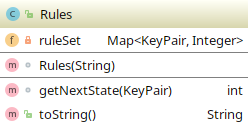


#### Clase Tag 

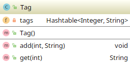


#### Clase Token 

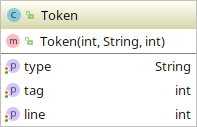


## Análisis sintáctico

### Casos de uso

#### Palabra reservada mal escrita

```
{
    declar // Error. Palabra reservada mal escrita
    begin
}
```

#### Palabra reservada en un lugar indebido

```
{
    declare
        int read; // Error. Palabra reservada usada en una mala posicion (como id)
    begin
}
```

#### Falta de paréntesis de cierre

```
{
    declare
    begin
        if (x == 1) // Error. Falta parentesis de cierre
        {
        }
}
```

#### Falta, exceso o mal uso de delimitadores

```
{
    declare
    begin
        print;(x); // Exceso de delimitadores
        read x; // Falta de delimitadores
        print()x; // Delimitadores mal ubicados
}
} // Doble llave (exceso de delimitadores)
```

#### Falta de operandos

```
{
    declare
    begin
        x = ; // Error. Falta de operandos
}
```

### Autómata

Se hace uso de un autómata de pila, que debido a la longitud de su definición, no se incluye en el presente archivo

### Diagramas de clases

#### Clase Control

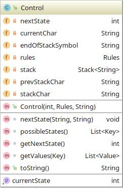

#### Clase Key

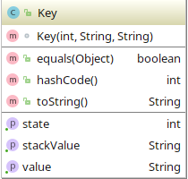

#### Clase PushDownAutomaton

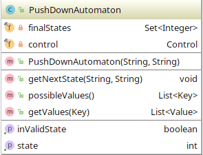

#### Clase Rules

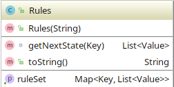

#### Clase Symbol

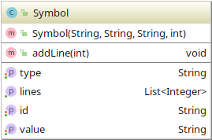

#### Clase Syntactic

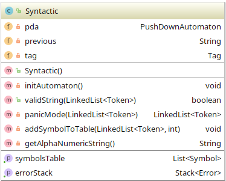

#### Clase Control

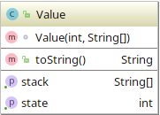

## Análisis semántico

### Casos de uso

#### Uso de un ID no declarado

```
{
    declare
    begin
        x = 10; // ID no declarado
}
```

#### Multiples declaraciones

```
{
    declare
        int x;
        float x; // Multiples declaraciones de 'x'
    begin
}
```

#### División entre cero

```
{
    declare
        int x;
        int y;
        float z;
    begin
        z = 10.0 / 0.0; // Division entre la constante cero
        x = 0;
        y = 50 / x; // Division entre un ID cuyo valor es cero
}
```

#### Incompatibilidad de tipos

```
{
    declare
        int y;
        float z;
    begin
        z = 10.0 / 50; // Incompatibilidad entre int y float
        y = 50 * true; // Incompatibilidad entre int y boolean
}
```

### Clase Semantic

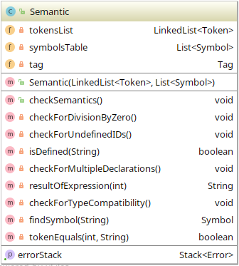