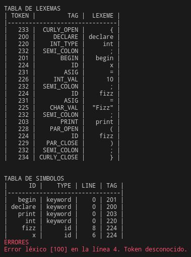

# Fase de análisis de un compilador

## Análisis léxico

### Resultado

En un código simple, como el siguiente:

```
{
// Comentario
declare
    int X;
begin
    x = 10;
    fizz = "Fizz";
	print(fizz);
}
```

El resultado es:




### Autómatas

Para la implementación del analizador léxico, se hizo uso de autómatas, 6 en total, estos identifican:

1. **ID**


2. **Números (enteros y flotantes)**


3. **Operadores relacionales (<, >, ==, !=, <=, >=)**


4. **Palabras reservadas**


5. **Cadenas**


6. **Símbolos de un carácter**


### Diagramas de clases

#### Clase Automaton 


#### Clase Control 


#### Clase Error 


#### Clase FileReader 


#### Clase KeyPair 


#### Clase Lexer 


#### Clase PrintErrors 


#### Clase Rules 


#### Clase Tag 


#### Clase Token 


## Análisis sintáctico

## Análisis semántico